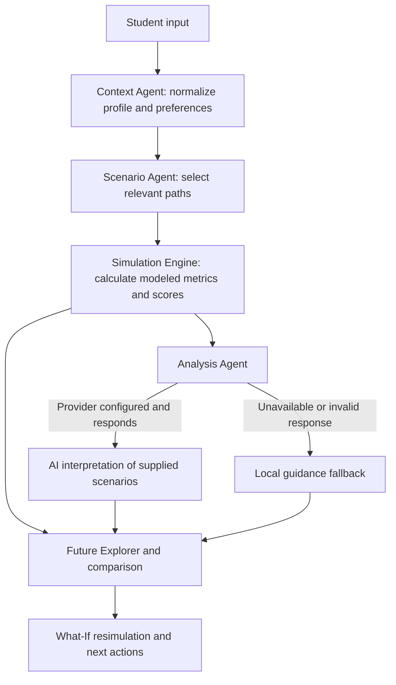

# FutureLens

> Explore possible futures before making important student decisions.

FutureLens is a student decision-support prototype for exploring how goals, available time, skills, priorities, and constraints shape modeled paths. Generate and compare scenarios, try supported What-If changes, and review the assumptions and practical guidance behind the results. These are conditional simulations for reflection, not certain predictions of what will happen.

## The problem

Students make choices about careers, projects, skills, and other priorities while balancing limited time and competing commitments. Static advice can suggest a direction, but it does not show how different choices or effort levels change the trade-offs under a student's own assumptions.

## The FutureLens approach

FutureLens turns a decision into an interactive loop:

```text
Student decision -> Scenario modeling -> Possible futures -> What-If change
       ^                                               |
Practical next action <- Explanation of change <- Recalculated futures
```

The result is a way to inspect alternative modeled paths, compare their trade-offs, and choose a next step with more context. The model makes its assumptions visible and does not guarantee readiness, admission, employment, or other outcomes.

## Why FutureLens

- **Explore instead of receiving one static recommendation.** Review multiple paths based on the submitted context.
- **Compare trade-offs.** Inspect modeled career, academic, financial, time, skills, and personal signals across scenarios.
- **Try What-If changes.** Adjust supported profile inputs and rerun the model to see how the results change.
- **See the workflow.** The interface reports context, scenario selection, simulation, and analysis stages, including fallback status.
- **Understand the limits.** Scenario assumptions and uncertainty are surfaced alongside risks, opportunities, and next actions when analysis is available.

## Core features

| Feature | What it does |
| --- | --- |
| Goal and profile setup | Collects a goal and specific objective, timeline, current skills and projects, weekly availability, priorities, trade-offs, risk preference, constraints, and optional notes. |
| Scenario modeling | Builds balanced, career-first, stability-first, and (for higher risk tolerance) exploration paths from the submitted context. |
| Future Explorer | Displays modeled paths and their readiness signals, with scenario details and assumptions. |
| Scenario comparison | Lets users select paths and compare overview or detailed metrics and differences. |
| What-If simulation | Recalculates scenarios when supported inputs such as weekly hours, consistency, or project count change. |
| Decision guidance | Shows analysis of scenario differences, trade-offs, risks, opportunities, assumptions, sensitivity factors, and next actions when available; local guidance remains available without AI analysis. |
| Judge demo | **Try Live Demo** fills a sample profile and runs it through the normal flow; the demo can be reset or exited. |

## How it works

1. Choose a goal category and a specific objective.
2. Add relevant profile information, including timeline, current skills and projects, weekly hours, priorities, and constraints.
3. Generate modeled futures through the workflow.
4. Explore the available paths and compare their modeled signals and trade-offs.
5. Change supported What-If inputs, such as hours, consistency, or projects, and recalculate.
6. Review why paths differ, the assumptions and uncertainty involved, and suggested next actions.

## Agentic workflow and architecture

The server runs a visible sequence of context preparation, scenario selection, deterministic simulation, and optional scenario analysis. The Context and Scenario Agents are implemented as deterministic JavaScript components; the Analysis Agent calls an AI provider when configured.



### Deterministic components

- **Context Agent** normalizes and bounds the decision, goal, current-state values, preferences, and student profile.
- **Scenario Agent** selects from the implemented balanced, career-focused, stability-focused, and exploration paths using career priority, academic priority, current career state, and risk tolerance.
- **Simulation Engine** clamps modeled metrics, normalizes weights, applies each path's fixed adjustments, and computes weighted overall scores. The current project signal adds three points per project to modeled career and skills, capped at fifteen points. These are model assumptions, not real-world probabilities.
- **Agent Orchestrator** runs context normalization, scenario selection, simulation, and analysis in sequence, then returns stage and agent status for the interface.

### AI components

The Analysis Agent sends the supplied decision context and deterministic scenario results to the configured Responses API provider. The prompt asks for uncertainty-aware interpretation of scenario differences, trade-offs, risks, opportunities, assumptions, sensitivity factors, and next actions; returned JSON is validated before use. The LLM interprets the model output—it does not calculate the scenario scores.

### Fallback behavior

AI analysis is optional. Without a configured provider, or if its request or response fails validation, deterministic simulation remains available and the app uses local guidance. What-If requests run the simulation workflow without invoking scenario analysis. The UI reports unavailable or fallback analysis rather than presenting it as completed AI output.

## Run locally

Requirements: Node.js 18 or later. The project uses Node's built-in server and `fetch`; there is no `package.json` or dependency installation step.

```powershell
node server.js
```

Open < http://localhost:3000>. To use another port, set `PORT` before starting the server.

### Optional AI analysis

Copy `.env.example` to `.env` and set a server-side `OPENAI_API_KEY`. `AI_MODEL` and `AI_API_URL` are optional and have defaults in `.env.example`. Keep `.env` private; never put provider keys in browser code or commit them. Without valid provider configuration, the deterministic simulation and local guidance fallback remain available.

## Judge demo

1. Start the local server and open < http://localhost:3000>.
2. Select **Try Live Demo** on the landing page. FutureLens enters a sample student profile and runs the normal onboarding and simulation flow.
3. Explore and compare the modeled paths, then try changing weekly hours, consistency, or project count in What-If.
4. Use **Reset Demo** to rerun the sample or **Exit Demo** to clear the sample session.

No hosted demo URL is configured in this repository; the judge demo runs locally.

## Checks

```powershell
node --check script.js
node --check server.js
node --check services/simulationEngine.js
node --check services/agentOrchestrator.js
node --test tests/simulationEngine.test.js tests/simulationApi.test.js
```
